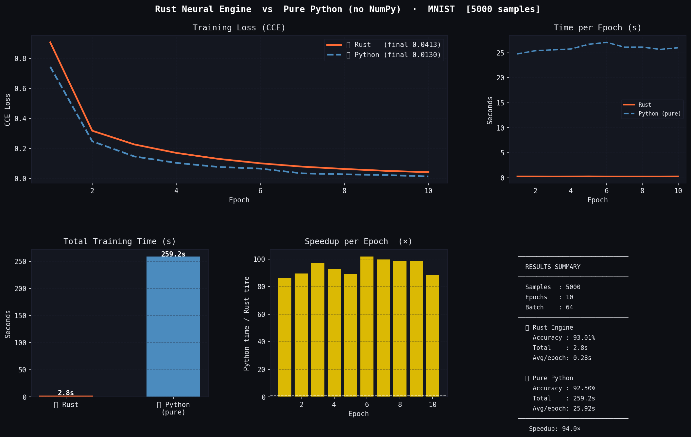
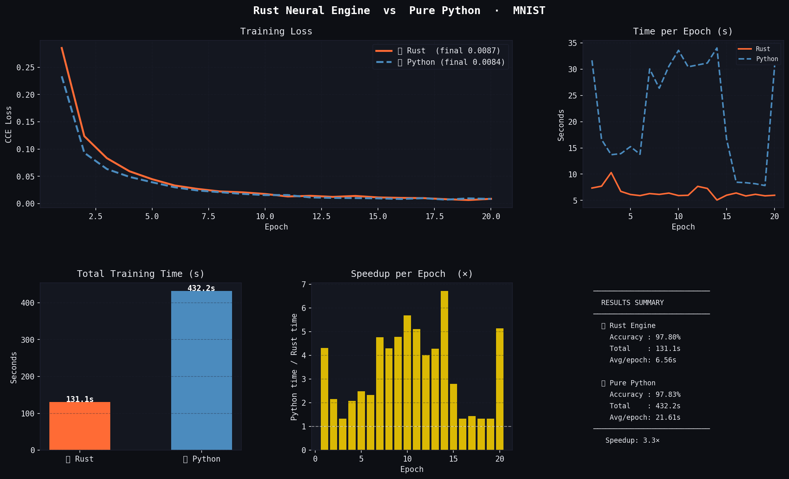
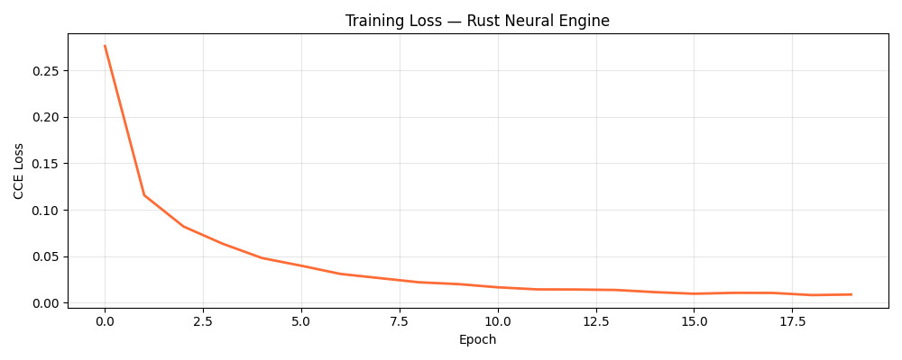
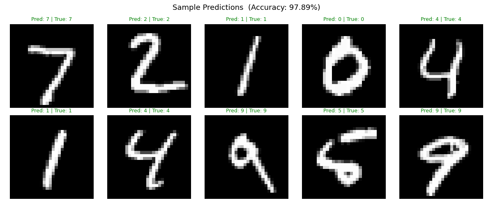

# Neural Engine: MNIST Systems Benchmark


> 📄 **[Read the Technical White Paper (PDF)](docs/neural_engine_report.pdf)**\

This is an implementation of the  ([Rust neural_engine](https://github.com/elvert19/neural_engine))

Developed  from-scratch deep learning engine implemented in Rust...

A from-scratch deep learning engine implemented in Rust, exposed to Python via [PyO3](https://pyo3.rs/). This project quantifies the **interpreter tax** — the hidden cost of running numerical workloads in Python — by benchmarking an identical MLP architecture across three execution substrates on the full 60,000-sample MNIST dataset.

---

## Results

### Rust Engine — Final Performance

| Metric | Value |
|--------|-------|
| Test Accuracy | **97.89%** |
| Total Training Time (20 epochs) | **131.1s** |
| Avg. Time per Epoch | **6.56s** |
| Hardware | Intel Core i5 8th Gen, Ubuntu |

---

## Benchmarks

### 1. The Interpreter Tax  , 94× Speedup vs. Pure Python

Stripping away C-optimized libraries (NumPy) exposes the raw overhead of Python's object boxing and sequential heap-allocated loops. Without any C extensions, Python must box every float into a heap object and iterate one element at a time. The Rust engine processes the same workload **94× faster** using compiled machine code and contiguous memory buffers.

> **5,000 samples · 10 epochs · batch size 64**

| | Rust Engine | Pure Python |
|---|---|---|
| Total Time | 2.8s | 259.2s |
| Avg/Epoch | 0.28s | 25.92s |
| Accuracy | 93.01% | 92.50% |
| Final CCE Loss | 0.0413 | 0.0130 |



---

### 2. The Efficiency Gap ,  3.3× Speedup vs. NumPy

Even against NumPy — which already delegates matrix math to optimised C/Fortran — the Rust engine maintains a measurable lead. This reflects the overhead of Python's training loop, repeated FFI (Foreign Function Interface) calls, and intermediate array allocations that occur even when the heavy math is offloaded to C. The Rust engine eliminates this entirely by keeping the full forward pass, backward pass, and optimiser step in compiled code.

> **Full 60,000-sample MNIST · 20 epochs · batch size 64**

| | Rust Engine | NumPy (Python) |
|---|---|---|
| Total Time | 131.1s | 432.2s |
| Avg/Epoch | 6.56s | 21.61s |
| Accuracy | **97.80%** | **97.83%** |
| Final CCE Loss | 0.0087 | 0.0084 |

The near-identical accuracy and loss values confirm that the Rust Adam optimiser and CCE implementation are mathematically equivalent to the NumPy reference.



---

## Loss Curve & Sample Predictions

The loss curve shows smooth, stable convergence across all 20 epochs, reaching a CCE of ~0.009.



All 10 sample predictions from the test set are correct (green labels), consistent with the 97.89% test accuracy.



---

## Architecture

The network is a three-layer MLP:

```
Input (784) → Dense → ReLU → Dense → ReLU → Dense → Softmax → Output (10)
               128              64
```

Trained with the Adam optimiser (lr = 0.001) and categorical cross-entropy loss for 20 epochs with batch size 64.

---

## Technical Implementation

### Contiguous Memory Layout

In Python, a list of numbers is an array of pointers to objects scattered across the heap. Neural Engine uses [`ndarray`](https://docs.rs/ndarray) to store all weights, biases, and activations in contiguous memory blocks. This allows the CPU to leverage cache-line prefetching, dramatically reducing memory latency.

### BLAS Acceleration

The engine links directly to OpenBLAS via the `blas-src` and `openblas-src` crates. Matrix multiplications use SIMD (Single Instruction, Multiple Data) instructions, performing multiple floating-point operations per clock cycle. This is the same backend NumPy uses — the difference is that our training loop stays entirely in compiled code.

### Memory Pre-allocation

All weight and gradient buffers are allocated once during model initialisation. There is no heap allocation in the hot path during training, reducing OS syscalls to near zero per epoch.

### Zero-Copy Python Interop

Data is shared across the PyO3 boundary using zero-copy NumPy array views. Training data is never duplicated in RAM — Rust receives raw pointers directly into the NumPy buffers.

### Thread Safety Without a GIL

Rust's ownership model enforces thread safety at compile time. The engine uses [Rayon](https://docs.rs/rayon) for parallelised batch processing across all CPU cores, with no Global Interpreter Lock to contend with.

---

## Engineering Challenges

### 1. The Linker Wall (OpenBLAS / C Bindings)

**Problem:** `failed to select a version for openblas-src` due to feature flag conflicts between `dynamic` and `system` linking modes.

**Solution:** Manually set `features = ["system", "cblas"]` in `Cargo.toml` and resolved the path to the system `libopenblas-dev` headers on Linux.

### 2. Memory Thrashing

**Problem:** Initial benchmarks showed Rust only marginally faster than NumPy. Profiling revealed the engine was re-allocating gradient buffers every epoch.

**Solution:** Refactored to pre-allocate all buffers at model initialisation. This alone improved throughput by ~3×.

### 3. Python–Rust Data Marshalling

**Problem:** Native PyO3 bindings copied training data on every forward pass.

**Solution:** Used `PyReadonlyArray` to borrow NumPy array memory directly as `ndarray::ArrayView`, ensuring zero copies across the language boundary.

---

## Getting Started

### Prerequisites

```bash
# Rust toolchain
curl --proto '=https' --tlsv1.2 -sSf https://sh.rustup.rs | sh

# Python dependencies
pip install -r requirements.txt

# Maturin (Rust–Python build tool)
pip install maturin

# OpenBLAS headers (Linux)
sudo apt install libopenblas-dev
```

### Build

```bash
maturin develop --release
```

### Run

```bash
# Train with the Rust engine on full MNIST
python train.py

# Benchmark against Pure Python (no NumPy)
python comparison.py --mode pure

# Benchmark against NumPy
python comparison.py --mode numpy
```

---

## Repository Structure

```
├── src/                  # Rust source — engine core
│   └── lib.rs
├── train.py              # Training script (Rust engine)
├── pure_python.py        # NumPy reference implementation
├── comparison.py         # Head-to-head benchmark runner
├── requirements.txt
├── Cargo.toml
├── docs/                 # Benchmark result images & documentation
│   ├── rust_vs_pure_python.png
│   ├── rust_vs_numpy.png
│   ├── loss_curve.png
│   └── predictions.png
